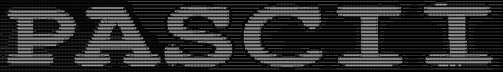

**P**ixel **ASCII** is a program that converts each pixel in the user's device's camera frame into an ASCII character,
then displays it in the application window - where the user can apply various video affects and choose from different
ASCII character sets.

### How It Works:
Live video is a series of images (frames), which contain a few thousand pixels. Each pixel contains red, green, and
blue values (RGB) that combine to create the pixel's color. This program converts each of those pixels into a greyscale
value between 0 and 1 using the red value of the pixel. That decimal value is later formulated to an index that
corresponds to an ASCII character in the character set, which is then displayed in the program window, thousands of
times a second, creating the live video filter.

### Image Affects Include:
- Color Inversion
- Horizontal Video Mirroring
- Edge Detection
- Noise
- Display Resolution

### Character Sets:
| Set Name       | Set Characters                                                       |
|----------------|----------------------------------------------------------------------|
| ASCII Minimal  | .,-~:;!#$@                                                           |
| ASCII Detailed | .`^\\",:;Il!i~+_-?[]{}1()\|/tfjrxnuvczXYUJCLQ0OZmwqpdbkhao*#MW&8%B@$ |
| Blocky         | ░▒▓█                                                                 |
| Brail          | ⠁⠃⠇⠏⠟⠿⡿⣿                                                             |
| Boxes          | ─│┌┐└┘├┤┬┴┼                                                          |
| Shapes         | .·˚°○●■□▲▼◆◇                                                         |
| Void           | .                                                                    |

### Purpose
Pascii was a fun weekend project - established in a few hours, refined over a few days. It was meant to be a personal
video-to-ascii filter that I could customize to my own liking. This project could also be paired with OBS's virtual
camera to display this program's ASCII output as live camera output.
